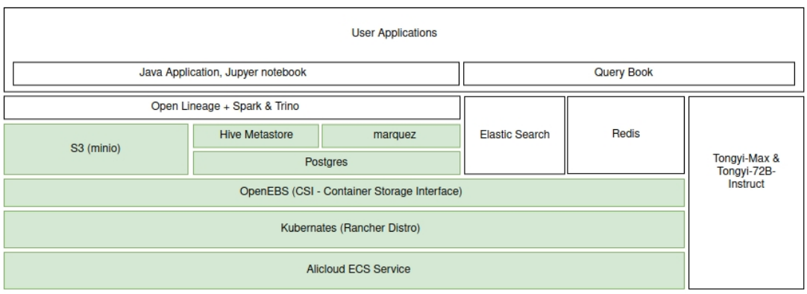

# AILook Studio

AILook Studio is a tool base on querybook IDE that allows you to do dataset analysis with AI and data lineage information.

# Project Purpose
### User Level
1. Provide a unified place for reporting and analysis with AI across multiple SQL engines.
2. Enable better understanding of data sources.
3. Offer an easy way to know dataset logic.
4. Enhance AI's ability in SQL generation, language conversion and adjustment.

### Application Level
1. Break down the barriers among different lineages in code, compute engines, and applications.

# Architecture

# Features - From querybook

-   📚 Organize **analyses** with rich text, queries, and charts
-   ✏️ Compose queries with **autocompletion** and hovering tooltip
-   📈 Use scheduling + charting in DataDocs to build **dashboards**
-   🙌 Live query **collaborations** with others
-   📝 Add additional **documentation** to your tables
-   🧮 Get lineage, sample queries, frequent user, search ranking based on **past query runs**

For querybook, please check below:
[Check out the full documentation & feature highlights here.](https://querybook.org)
